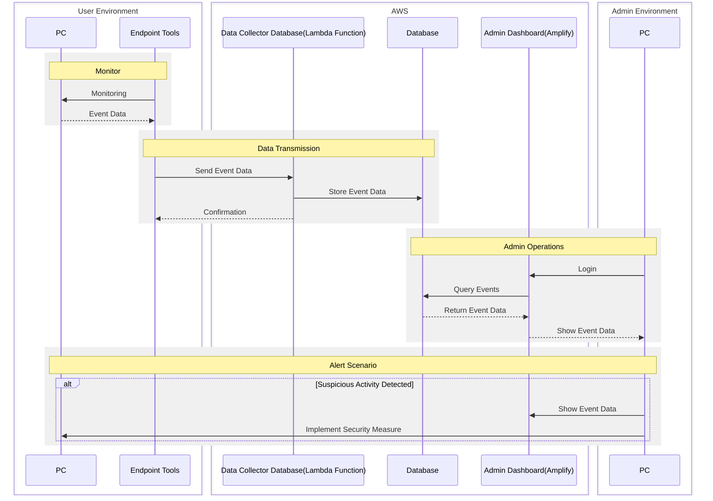

# Endpoint Security and Monitoring Tools
Security tool for monitoring endpoints

## Overview
This project is a security tool designed for endpoint monitoring.  
It provides various security monitoring capabilities to observe and track activities on endpoint devices.

## Features
**Planned to add in the future**
- **USB File Transfer Monitoring**: Tracking of file transfers to USB devices

## System Architecture

## Technology Stack
- Endpoint Tools
    - Go Lang
- Data Collector Database
    - AWS
        - Lambda
            - Python
- Database
    - AWS
        - DynamoDB
- Admin Dashboard
    - AWS
        - Amplify
    - React
